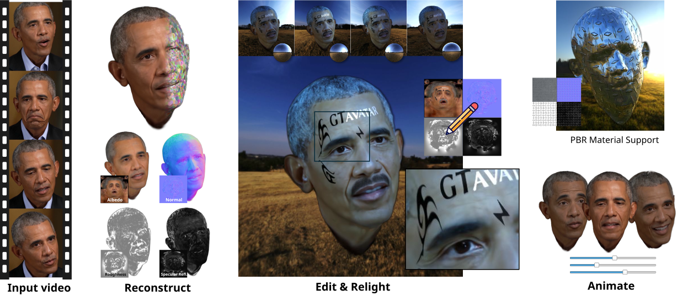
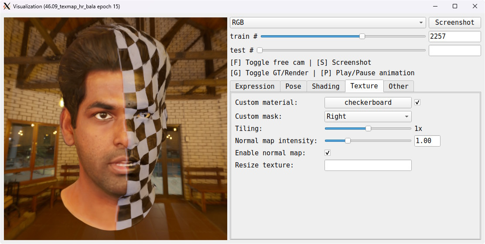

<p>
    <h1 align="center">
    	<b>GTAvatar</b><br>
		<small align="center">Bridging Gaussian Splatting and Texture Mapping for Relightable and Editable Gaussian Avatars</small>
	</h1>
    <p align="center">
        <a href="mailto://kelian.baert@gmail.com"><strong>Kelian Baert</strong></a>
        ·
        <a href="https://maeyounes.github.io/"><strong>Mae Younes</strong></a>
        ·
        <a href=""><strong>Francois Bourel</strong></a>
        ·
        <a href="https://people.irisa.fr/Marc.Christie/"><strong>Marc Christie</strong></a>
        ·
        <a href="https://boukhayma.github.io/"><strong>Adnane Boukhayma</strong></a>
    </p>
    <p align="center">
        <a href="https://www.univ-rennes.fr/en">Université de Rennes</a> | <a href="https://www.inria.fr/en/inria-centre-rennes-university">INRIA Rennes</a> | <a href="https://www.cnrs.fr/en">CNRS</a> |
        <a href="https://www.irisa.fr/en">IRISA</a>
        <br>
        <strong>Eurographics 2026</strong>
    </p>
    <p align="center">
        <a href="https://kelianb.github.io/GTAvatar/">Project page</a>
        |
        <a href="https://doi.org/10.1111/cgf.70351">Paper</a>
        |
        <a href="https://arxiv.org/abs/2512.09162">arXiv</a>
    </p>
</p>
<p float="center" style="text-align: center">
    
</p>

This repository contains the official code for "GTAvatar: Bridging Gaussian Splatting and Texture Mapping for Relightable and Editable Gaussian Avatars". From a single video, we reconstruct a 3D head avatar enabling animation, relighting and texture editing, with the training efficiency, rendering speed and visual fidelity of Gaussian Splatting.

The code for our custom textured Gaussian renderer, used in this project, is available here: https://github.com/KelianB/diff-surfel-rasterization-uv-tex

## :gear: Installation

1. Clone this repository:
```bash
git clone --recursive git@github.com:KelianB/GTAvatar.git

# or, if you already cloned non-recursively:
git submodule update --init
```

2. Create the environment using [setup_env.sh](./setup_env.sh).
3. Download the FLAME geometry and texture space and move both zips to this directory. You will have to register and agree to the license terms of Max Planck Institute.
    - [FLAME2020.zip](https://download.is.tue.mpg.de/download.php?domain=flame&resume=1&sfile=FLAME2020.zip)
    - [TextureSpace.zip](https://download.is.tue.mpg.de/download.php?domain=flame&resume=1&sfile=TextureSpace.zip)
4. Extract and move FLAME files and SMIRK weights using [setup_assets.sh](./setup_assets.sh).

These instructions have been tested on Ubuntu 24.04.

<details>
    <summary>Optional steps</summary>

- If you want to use the texture space of Basel Face Model, use the tool from this [repo](https://github.com/TimoBolkart/BFM_to_FLAME) and put the resulting texture model file at `assets/flame/FLAME_albedo_from_BFM.npz`. In our testing, we obtained better results with the FLAME albedo prior. 

- Some environment maps are provided for testing in [assets/envmaps](./assets/envmaps/). To download more from [polyhaven.com](https://polyhaven.com), run `python download_hdrs.py --output_dir ./assets/envmaps`

</details>
<br/>


> [!NOTE]
> GTAvatar requires at least 5 GB of GPU memory.

## :movie_camera: Data preprocessing

We support two dataset formats:

- [MonoFaceCompute](https://github.com/KelianB/MonoFaceCompute) [recommended]: this provides more options and has better tracking and masking. We recommend this if you want to preprocess your own data. Refer to the [repository](https://github.com/KelianB/MonoFaceCompute) for instructions.
- [HRAvatar](https://github.com/Pixel-Talk/HRAvatar): all visuals in the paper, as well as comparisons with other methods, were made using the dataset preprocessing from HRAvatar.
    - Instructions for downloading the INSTA and HDTF datasets are available on their repository.
    - Make sure to set `--loss_normals_supervise_weight 0` for training if you use this, or use [Sapiens](https://github.com/facebookresearch/sapiens/blob/main/lite/README.md) to estimate normals on the input videos for improved results (tested with the `sapiens_1b_normal_render_people_epoch_115_torchscript.pt2` model, computing normals for every fourth image).

## :fire: Demo

A few trained avatars are provided [here](https://drive.google.com/drive/folders/1fwQ9SlKfbvMzZFYwAQhGE02_D88GThCA?usp=sharing) for quick testing. This command starts an interactive window that lets you interact with the avatar, apply custom textures and relight with environment maps:

```
python interact.py --detached /path/to/checkpoint.pt
```

<p float="center" style="text-align: center;">
    
</p>

> [!NOTE]
> The `--detached` argument loads a standalone avatar from a checkpoint without requiring access to the dataset. Rendering will be faster because it uses cached FLAME parameters, removing the dependency on Mediapipe for cropping and SMIRK for predictions. This mode cannot be used for evaluation, since the input images are not included.

## :wrench: Usage

To optimize an avatar for 15 epochs, run: 
```bash
# Reconstruct avatar
python train.py --config configs/1_default.yaml --input inputs/insta/bala.yaml --epochs 15
```
This will take 1-3 hours depending on GPU and video length. Once trained, you can load your avatar with any of the following scripts:
```bash
# Run evaluation
python test.py -c configs/1_default.yaml -i inputs/insta/bala.yaml --resume_epoch 15

# Render frames from a trained avatar
python render.py -c configs/1_default.yaml -i inputs/insta/bala.yaml --resume_epoch 15 --render_train --render_test --albedo --normals --relight assets/envmaps/cobblestone_street_night_1k.hdr
# To relight with preprocessed environment maps in the same format as HRAvatar:
python render.py -c configs/1_default.yaml -i inputs/insta/bala.yaml --resume_epoch 15 --relight path/to/hravatar/assets/envmaps/cobblestone_street --relight_hravatar_mode

# Open the avatar in an interactive window
python interact.py -c configs/1_default.yaml -i inputs/insta/bala.yaml --resume_epoch 15
# or, in detached mode:
python interact.py --detached path/to/checkpoint.pt
```

For a list of all parameters, please refer to [arguments.py](./avatar/arguments.py) or run `python train.py --help`. Parameters can be passed either in the configuration file or as command line arguments.
We provide two configurations:
- `configs/1_default.yaml`: The default configuration.
- `configs/1_metrics.yaml`: Small improvements to reconstruction at the cost of texture mapping quality. On average, this improves PSNR by 0.1 dB and LPIPS by 0.005 for the self-reenacment task on the INSTA dataset.

## :page_facing_up: Citation

If you use our code or paper in your work, please cite us as:

```bibtex
@article{baert2026gtavatar,
    author = {Baert, Kelian and Younes, Mae and Bourel, Francois and Christie, Marc and Boukhayma, Adnane},
    title = {GTAvatar: Bridging Gaussian Splatting and Texture Mapping for Relightable and Editable Gaussian Avatars},
    journal = {Computer Graphics Forum},
    volume = {n/a},
    number = {n/a},
    pages = {e70351},
    doi = {https://doi.org/10.1111/cgf.70351},
    url = {https://onlinelibrary.wiley.com/doi/abs/10.1111/cgf.70351},
    eprint = {https://onlinelibrary.wiley.com/doi/pdf/10.1111/cgf.70351},
}
```

## :copyright: License Information

The contents of this repository are subject to multiple licenses.

1. **Third-Party Code** (Max Planck Institute for Intelligent Systems)
   - Parts of the code in [./flame](./flame) and assets in [./assets/flame](./assets/flame) are only available for **non-commercial scientific research purposes**. See the [model license](https://flame.is.tue.mpg.de/modellicense.html) and [texture license](https://flame.is.tue.mpg.de/texturelicense.html) of FLAME from Max Planck Institute.
    - The Gaussian Splatting renderer is based on the work of the GRAPHDECO research group (https://team.inria.fr/graphdeco). It is free for **non-commercial, research and evaluation use**.

2. **Original Code** (INRIA Rennes)
   - All code in this repository, except where otherwise specified, is licensed under the [Apache 2.0 License](./LICENSE).

3. **Assets** 
    - Environment maps in [assets/envmaps](./assets/envmaps): CC0 LICENSE 
    - Textures in [assets/textures](./assets/envmaps): CC0 LICENSE 
